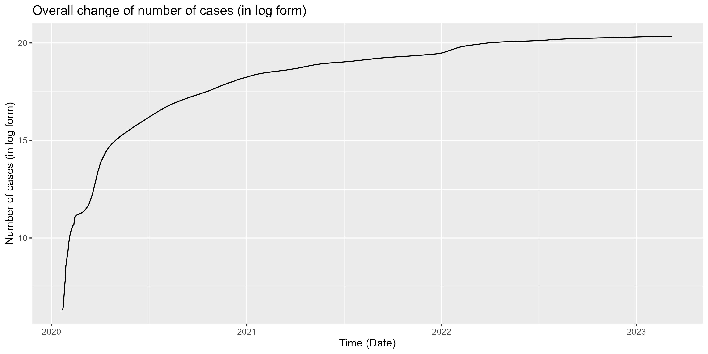
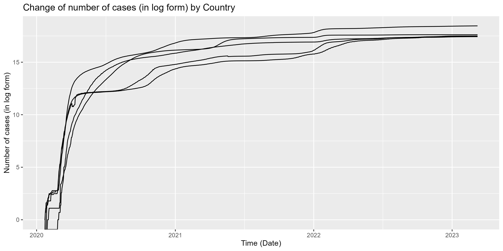
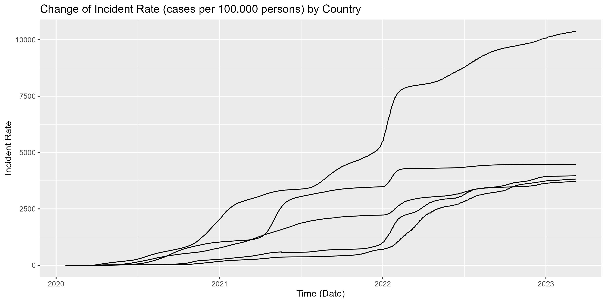

# SURV675 S2024 Assignment 1


## Contents

- [Description](#description)
- [Repo Contents](#repo-contents)
- [Main findings](#main-findings)
- [Demo](#demo)


### Description

In this project we aim to investigate the trend of COVID-19 cases over the past few years. All data are downloaded from [JHU CSSE COVID-19 Dataset](https://github.com/CSSEGISandData/COVID-19/tree/master/csse_covid_19_data).


### Repo Contents 

- [code](./code): `R` code to reproduce the graphs.
- [data](./data): downloaded and processed data.
- [figures](./figures): output graphs.


### Main findings 


We can see that overall the number of cases has been increasing since 2020.


The trends in different countries are consistent with the overall trend.


That being said, the change in incident rates differs among different countries.


### Demo

`R` code for downloading the data sets. You may need to install package `readr` first, to do so please run `install.packages("readr")` in an `R` session.

```
library(readr)

urlfile = "https://raw.githubusercontent.com/CSSEGISandData/COVID-19/master/csse_covid_19_data/UID_ISO_FIPS_LookUp_Table.csv"
urlfile1 = "https://raw.githubusercontent.com/CSSEGISandData/COVID-19/master/csse_covid_19_data/csse_covid_19_time_series/time_series_covid19_confirmed_global.csv"

UID_ISO_FIPS_LookUp_Table = read_csv(url(urlfile))
time_series_covid19_confirmed_global = read_csv(url(urlfile1))
```


