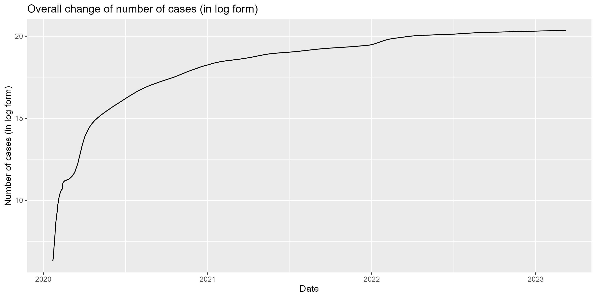

# SURV675 S2024 Assignment 1
SURV675 S2024 Assignment 1 Q3

a. description of the project (what you aim to do, where you got the data from, etc.)

b. explain the organization of the repo (folder structure, where they can find the data and scripts, what were the steps in creating the report)

c. main findings where you include the three graphs and a sentence or two on their interpretation

d. session info to help with reproducibility

