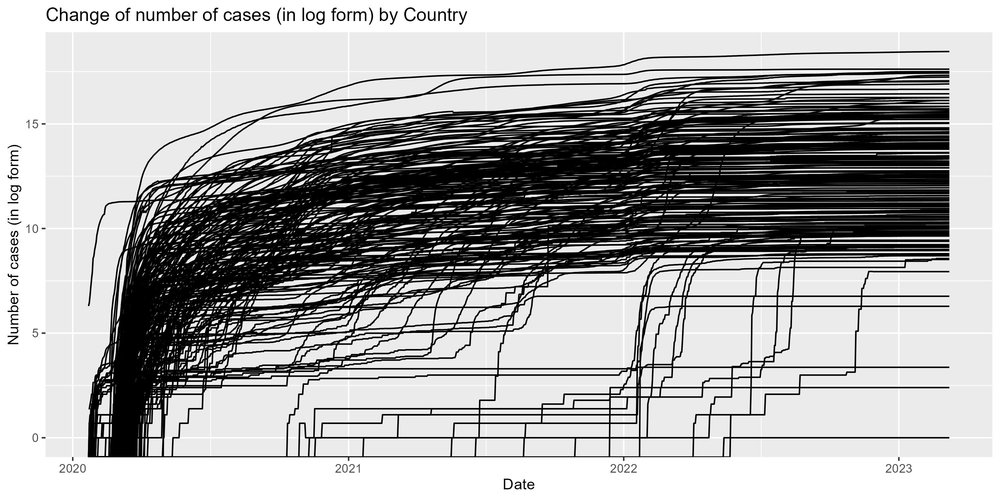
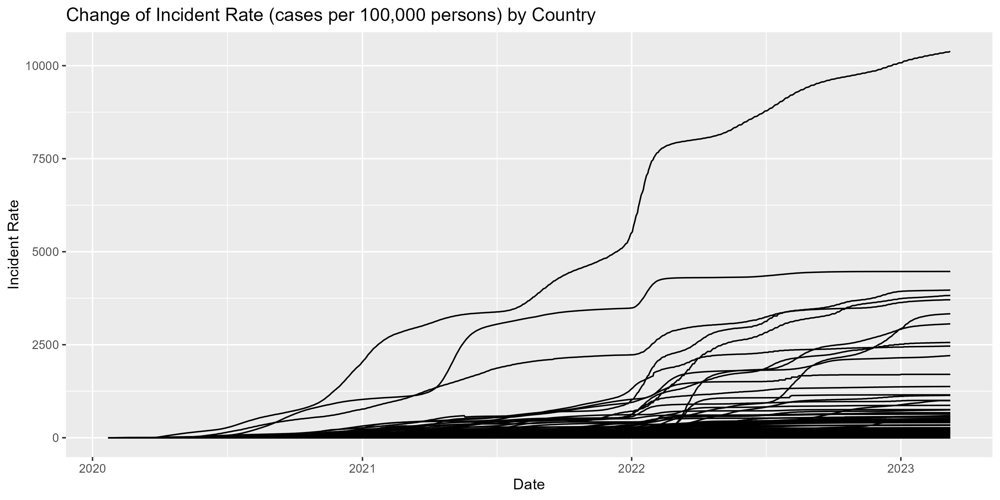

# SURV675 S2024 Assignment 1
SURV675 S2024 Assignment 1 Q3

## Contents

- [Description](#description)
- [Repo Contents](#repo-contents)
- [Main findings](#main-findings)
- [Demo](#demo)

### Description

In this project we aim to investigate the trend of COVID-19 cases over the past few years. All data are downloaded from [JHU CSSE COVID-19 Dataset](https://github.com/CSSEGISandData/COVID-19/tree/master/csse_covid_19_data).

### Repo Contents 
(folder structure, where they can find the data and scripts, what were the steps in creating the report)

### Main findings 
(where you include the three graphs and a sentence or two on their interpretation)

### Demo

